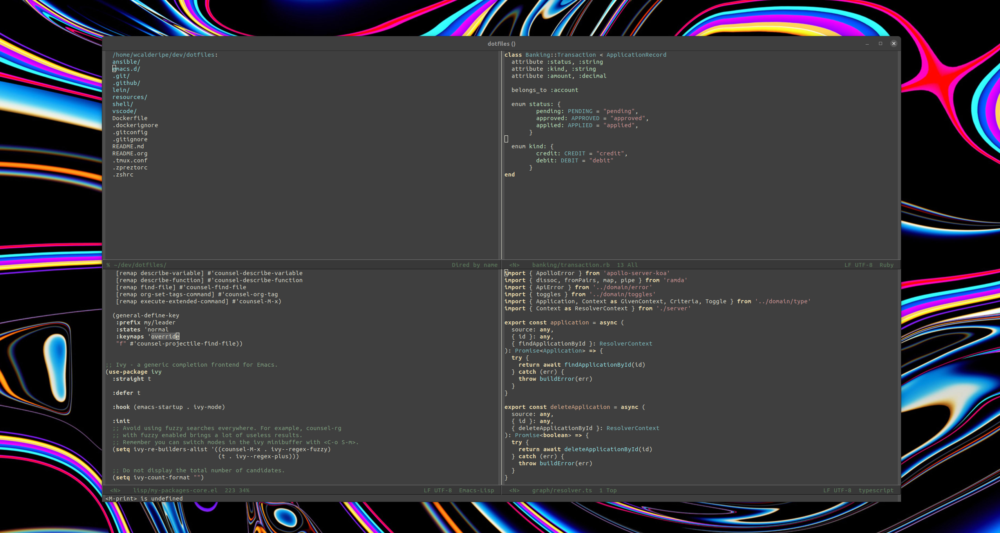

# Dotfiles



## Installation on Ubuntu

```bash
sudo apt update && sudo apt install --yes curl git

# Clean up to start from scratch (optional step)
curl -Lks https://raw.githubusercontent.com/wcalderipe/dotfiles/master/shell/clean.sh | /bin/bash

# Install dotfiles
curl -Lks https://raw.githubusercontent.com/wcalderipe/dotfiles/master/shell/setup.sh | /bin/bash
```
